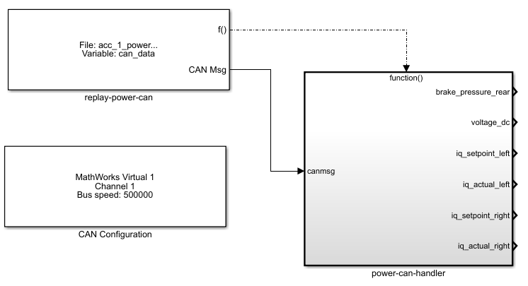
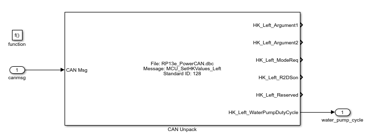

Vector BLF to MATLAB/Simulink VNT Logfiles Converter
====================================================

Use this tool to convert CAN frame log (without a DBC file) into a MAT file that can be read
by the MATLAB/Simulink Vehicle Networking Toolbox CAN Replay block. The two formats are CAN
frame based, meaning there is no information about signals. You will need a DBC file or another
signal description inside your CAN Unpack blocks.

## Required software

* Boost Libraries (tested with 1.67.0): [[boost_1_67_0-msvc-14.1-64.exe](https://dl.bintray.com/boostorg/release/1.67.0/binaries/boost_1_67_0-msvc-14.1-64.exe)]
* BLF Reader by Tobias Lorenz: https://bitbucket.org/tobylorenz/vector_blf
* MATLAB MAT File I/O Library: http://matio.sf.net

## How to build

1. Open Visual Studio solution file
2. Check include and lib folders and adjust them to your installation
3. Build x64

## Usage

1. Download the latest version on the "releases" tab
2. Start command line (press Win+R, enter ```cmd.exe```) and navigate to the extracted files
3. Execute ```vblf2slvnt.exe --help``` to get a general description as well as a list of example commands

```
# vblf2slvnt.exe --help
Vektor BLF to Simulink VNT CAN Logfile Converter
(C) 2018 Stefan Urban <stefan.urban@live.de>
Version  1.0.0.1 - Build Jun 30 2018 10:39:10

Usage: vblf2slvnt.exe [options] <input-file.blf> <output-file.mat>

Examples:

  - Use quotation marks if your paths contain spaces:
    vblf2slvnt.exe "C:\log files\courseA.blf" "C:\mat files\courseA.mat"

  - Create MAT only with data from 10s to 20s:
    vblf2slvnt.exe -f 10.0 -t 20.0 courseA.blf courseA.mat

  - Create 20s long MAT file starting at 30s but skip empty time at beginning:
    vblf2slvnt.exe -f 30.0 -d 10.0 -z courseA.blf courseA.mat

Common options:
  -v [ --version ]      print version string
  --help                produce help message
  -i [ --input ] arg    input file in Vektor BLF format
  -o [ --output ] arg   output file in MATLAB/Simulink VNT CAN log format

Select a timeframe inside the BLF file using:
  -f [ --fromtime ] arg (=0)            [secs] skip input file up to this time
                                        mark
  -e [ --endtime ] arg (=1.7976931348623157e+308)
                                        [secs] stop conversion at this time
                                        mark
  -d [ --duration ] arg                 [secs] stop conversion after this
                                        amount of time (has priority over
                                        endtime)

Choose how much the timebase should be moved (applied after the time section cut above):
  -m [ --moveby ] arg (=0) [secs] move the timestamps by this amount of seconds
  -z [ --movetozero ] arg  [0 or 1] shift timestamp vector so that the first
                           CAN frame starts at 0```
```

## How to integrate the resulting MAT file into Simulink

The MAT file matches the required structure to be loaded by the Vehicle Networking Toolbox Replay block. Always include a "CAN Configuration" block to set up a channel with the correct baud rate. Use the "CAN Replay" block with the option "Replay messages to" set to "Output port" to make sure to output data in simulation speed (see [MATLAB docs for the CAN Replay block](https://de.mathworks.com/help/vnt/ug/canreplay.html), section "Replay Timing").



All incoming CAN messages are handled by a "Function-Call Subsystem". In this subsystem each CAN message is unpacked into the signals it consists of. To use the signal in Simulink model define output ports as usual.



## ToDo

- More efficient implementation, very q'n'd

## License

Copyright (c) 2018 Stefan Urban

Permission is hereby granted, free of charge, to any person obtaining a copy of this software and
associated documentation files (the "Software"), to deal in the Software without restriction, including
without limitation the rights to use, copy, modify, merge, publish, distribute, sublicense, and/or
sell copies of the Software, and to permit persons to whom the Software is furnished to do so, subject
to the following conditions:

The above copyright notice and this permission notice shall be included in all copies or substantial
portions of the Software.

THE SOFTWARE IS PROVIDED "AS IS", WITHOUT WARRANTY OF ANY KIND, EXPRESS OR IMPLIED, INCLUDING BUT NOT
LIMITED TO THE WARRANTIES OF MERCHANTABILITY, FITNESS FOR A PARTICULAR PURPOSE AND NONINFRINGEMENT.
IN NO EVENT SHALL THE AUTHORS OR COPYRIGHT HOLDERS BE LIABLE FOR ANY CLAIM, DAMAGES OR OTHER LIABILITY,
WHETHER IN AN ACTION OF CONTRACT, TORT OR OTHERWISE, ARISING FROM, OUT OF OR IN CONNECTION WITH THE
SOFTWARE OR THE USE OR OTHER DEALINGS IN THE SOFTWARE.
